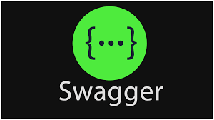

<div style="text-align: center;">
  <h1># Challenge Foro Hub - Alure - ONE #</h1>
</div>
<br/>

<p align="center">
    
</p>

Vamos a realizar nuestra propia API REST con la temática de un foro.<br/>
Foro Hub es una aplicación de foro diseñada para facilitar la comunicación y discusión entre usuarios.<br/>
Un lugar donde las personas puedan crear sus tópicos con sus dudas o con sugerencias que otras personas puedan también responder e interactuar allí dentro de una comunidad.<br/>


<h3># Características #</h3>
 
- Registro y autenticación de usuarios.
- Creación, edición y eliminación de tópicos.
- Respuesta a tópicos existentes.
- Listado de usuarios y tópicos.
- Autenticación mediante JWT.

<h3># Tecnologías utilizadas #</h3>


<div style="text-align: center;">
    <table style="margin: 0 auto;">
        <tr>
            <td style="text-align: center;">
                <br/>
                <strong>JAVA</strong>
            </td>
            <td style="text-align: center;">
                <br/>
                <strong>IntelliJ IDEA</strong>
            </td>
            <td style="text-align: center;">
                <br/>
                <strong>JWT Token</strong>
            </td>
        </tr>
    </table>
</div><br/><br/>

<div style="text-align: center;">
    <table style="margin: 0 auto;">
        <tr>
            <td style="text-align: center;">
                <br/>
                <strong>Maven</strong>
            </td>
            <td style="text-align: center;">
                <br/>
                <strong>MySQL</strong>
            </td>
            <td style="text-align: center;">
                <br/>
                <strong>Swagger</strong>
            </td>
        </tr>
    </table>
</div><br/><br/>

<div style="text-align: center;">
    <table style="margin: 0 auto;">
        <tr>
            <td style="text-align: center;">
                <br/>
                <strong>Spring Security</strong>
            </td>
            <td style="text-align: center;">
                <br/>
                <strong>Spring Boot</strong>
            </td>
            <td style="text-align: center;">
                <br/>
                <strong>Spring Data JPA</strong>
            </td>
        </tr>
    </table>
</div><br/>
<h3># Estructura del proyecto #</h3> 

- **Entities**: Clases de entidad que representan las tablas de la base de datos.
- **Dto**: Clases de Data Transfer Object utilizadas para transferir datos entre el cliente y el servidor.
- **Repository**: Interfaces que extienden JpaRepository para realizar operaciones CRUD en las entidades.
- **Service**: Clases de servicio que contienen la lógica de negocio.
- **Controller**: Clases de controlador que manejan las solicitudes HTTP.
- **Security**: Clases relacionadas con la configuración de seguridad y la autenticación.

<h3># Instalación #</h3>  

Clona este repositorio:
```
git clone 
```

Navega al directorio del proyecto:
```
cd Challenge_Foro_Hub https://github.com/FedVera/Challenge_Foro_Hub.git
```
- Abre el proyecto en tu IDE favorito (por ejemplo, IntelliJ IDEA).
- Configuración
- Base de datos: MySQL 


<h3># Swagger #</h3>   
Swagger está configurado para generar documentación de la API automáticamente. Puedes acceder a la interfaz de Swagger en la siguiente URL cuando el servidor esté en funcionamiento:
```
http://localhost:8080/swagger-ui/index.html
```


Ejecución
Para ejecutar la aplicación, utiliza el siguiente comando en la raíz del proyecto:
```
mvn spring-boot:run
```
La aplicación estará disponible en `http://localhost:8080`.

Endpoints principales:
- `/login`: Endpoint para autenticación de usuarios. Envía una solicitud POST con un JSON que contiene `username` y `password`.
- `/usuarios`: Endpoint para listar usuarios. Requiere autenticación mediante un token JWT.
- `/topicos`: Endpoint para manejar la creación, actualización y eliminación de tópicos.

### Ejemplos de solicitudes 

- Autenticación 

Solicitud:
```
POST http://localhost:8080/login
```
Body:
```
{
    "username": "nombre_usuario",
    "password": "contraseña"
}
```
Respuesta:
```
{
    "token": "jwt_token_generado"
}
```
- Crear un tópico 

Solicitud:
```
GET http://localhost:8080/topico/topicos
```
Headers:
```
Authorization: Bearer jwt_token_generado
Content-Type: application/json
```
Body:
```
{
  "totalPages": 1,
  "totalElements": 3,
  "size": 3,
  "content": [
    {
      "id": 1,
      "title": "Temática de Ciencias Exactas",
      "message": "Exploración y comprensión de conceptos fundamentales en matemáticas, física, y química.",
      "status": "ACTIVO",
      "usuario_Id": 1,
      "curso": "Introducción a la Matemática",
      "date": "2024-07-01T08:00:00.000Z"
    },
    {
      "id": 2,
      "title": "Historia y Cultura",
      "message": "Estudio detallado de eventos históricos y desarrollo cultural a través de los tiempos.",
      "status": "ACTIVO",
      "usuario_Id": 2,
      "curso": "Civilización Antigua",
      "date": "2024-07-02T09:30:00.000Z"
    },
    {
      "id": 3,
      "title": "Arte y Diseño",
      "message": "Apreciación y creación artística, explorando diversas formas de expresión visual.",
      "status": "ACTIVO",
      "usuario_Id": 3,
      "curso": "Dibujo y Pintura",
      "date": "2024-07-03T11:00:00.000Z"
    }
  ],
  "number": 0,
  "sort": "asc",
  "first": true,
  "last": true,
  "numberOfElements": 3,
  "pageable": {
    "offset": 0,
    "sort": "asc",
    "paged": true,
    "unpaged": true,
    "pageNumber": 0,
    "pageSize": 3
  },
  "empty": false
}


